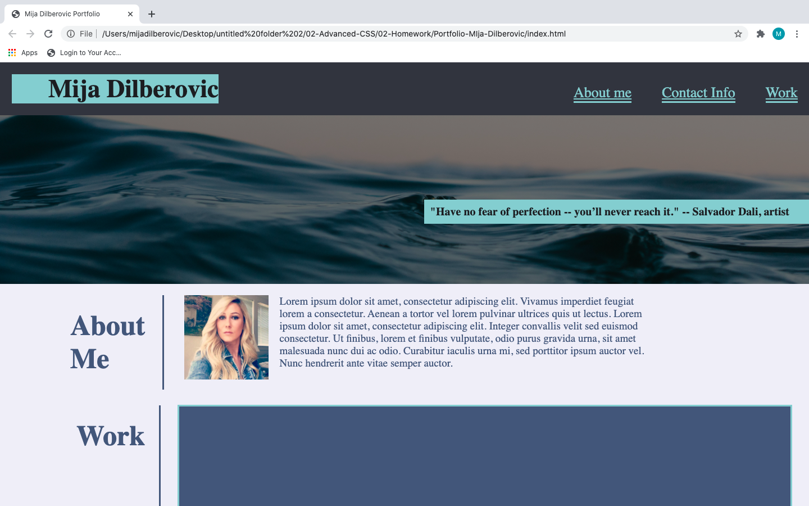
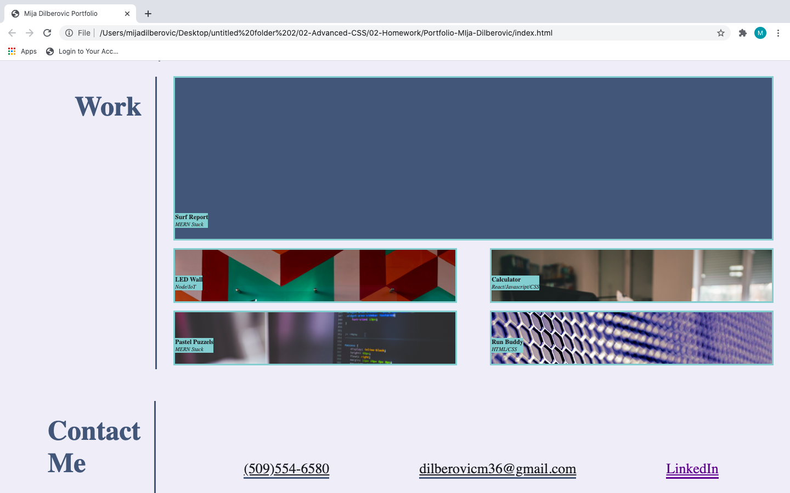

## Portfolio-Mija-Dilberovic
 
Website was built with a responsive layout with several sections;

* Header and nav bar links;
* Hero image was added after the header;
* About me section with a short introductory paragraph;
* Work section with 5 projects;
* Footer containing contact info.

# Nav bar links 

When clicking on the nav bar links UI scrolls to the appropriate section.

# Work 

5 projects cards with background images ( currently no projects to display). When you click on the images they take you to the top of the page since there are no links currently added. Also when hovering over the images the opacity changes. 

# Footer

Footer contains all the contact info, phone email and LinkedIn account. These are all links to make it easier to be contacted, eg clicking on email it automatically populates a template.

Image of what the project is supposed to look like : 

Finished product :

